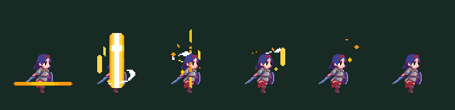
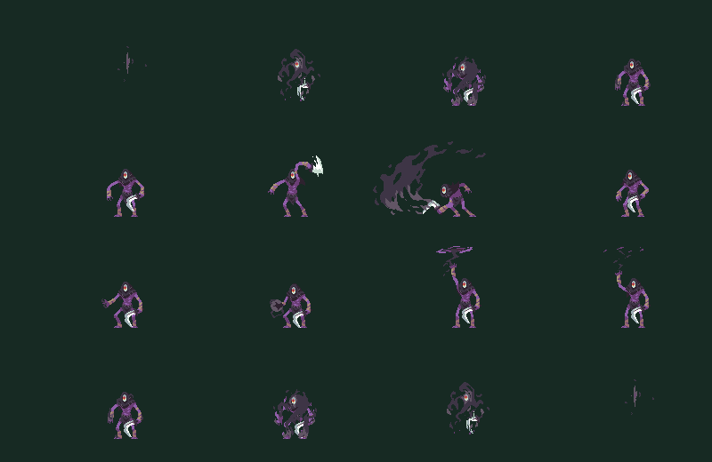

# Forest boss arena verification

## Production release: 2026.10.8

Deployed October 7, 2026 (Helsinki time) to
[production Hosting](https://rpg-runner-d7add.web.app), Firebase Functions and
Cloud Run from frozen commit `18d00737f6b3555811c3a54105dde6a14b084144`.
The merge commit is `7c1bad00`; its newer Forest authoring and release fixes
were retained. Source fingerprint: `784d75d0893bd32c82c0a78b6773bd1dda7f7a76d2f3865930c531f823648a02`.
Client, Functions, worker and boards use `2026.10.8`, `rules-v2`, `score-v4`
and `ghost-v1`; replay/command formats remain 1.

### Prepared artifacts and exact-image checks

- Fresh client analysis, **1,122 client tests** and the release web build passed,
  including the WASM dry run. Functions build and **212 emulator tests** passed.
- Shared checks passed: **994 Core**, **44 protocol**, **91 content-pipeline**
  and **25 terrain-material** tests, with analysis and generated freshness for
  **80 chunks, three levels, three parallax themes and three terrain materials**.
- Matching cached validator evidence was reused: **201 tests**, analysis and
  the compiled AOT protocol-rejection probe. Runtime inputs match; this was
  successful evidence from preparation of the merge, not an omitted gate.
- Fresh production dependency audit: no known vulnerabilities. The first frozen
  preparation failed five stale board assertions; the fixture-only correction
  passed 30 focused checks and the final 212-test gate. Failed checks were not
  treated as release evidence.
- Cloud Build `85abc066-66ee-40fa-9475-fb6bd7625033` succeeded. Its strict
  **36,000-tick per level** benchmark of the exact image at **one CPU / 512 MiB**
  passed all nine gates: Forest **1.573 s**, Field **1.784 s**, new-level **1.740 s**.
  All replay outcomes match. The no-enemy Forest benchmark stalls around 332
  units at geometry version 1; actual boss coverage comes from the combat/replay
  tests. Separate container CI and unchanged mocked release-tool tests were not
  rerun and are not claimed as passing current live gates.

Immutable worker:
`europe-west1-docker.pkg.dev/rpg-runner-d7add/replay/replay-validator@sha256:dbcc4fc3eab1ce23ecc3e734bd1dfa4acb1bbfb1a61646d4d169d4e34144a82a`.
Functions build digest: `64f4f614c021595d556ae18294412df0339e6c6e2b0477a4f2080fc4f26b03e0`.
Web tree digest: `0539426d40eea36c2a3e00618385520a245edf0b9c2c05e03a89d1aae00f7de5`.
Live `main.dart.js` SHA-256 matches the prepared bytes:
`08873fcc906d3ba2d0657f3e8f7d36066bf8acae3bed5a8dc14bb467a6cafb53`.

### Live cutover verification

The owner authorized merge, deployment, cancellation only if needed, and cleanup.
Issuance paused at `2026-10-06T23:27:43.1901561Z` on a healthy serving revision.
The fresh paused inventory had **zero active runs**, **191 accepted validations**
and **191 settled grants**, with no pending/quarantined settlement. No runs were
cancelled or data reset; the 20 cancellations and 23 expirations are historical.

Functions deployed at `2026-10-06T23:36:20.1467706Z`, worker at
`2026-10-06T23:38:35.3080332Z`, and Hosting at `2026-10-06T23:39:08.6183832Z`.
All six current/next boards were verified before resumption. Issuance restored
at `2026-10-06T23:44:59.7948271Z` after matching worker/web verification.
The final inventory at `2026-10-06T23:46:28.087Z` confirmed **26 ACTIVE
Functions**, both queues **RUNNING**, six expected boards present, and the
same 191 settled runs. Ready worker `replay-validator-00049-g42` and ready
issuer `runsessioncreate-00044-vph` serve **100% traffic**. The issuer has no
temporary supported-version override. The verified baseline is retained in
`.tmp/release-cache/deployments/rpg-runner-d7add/europe-west1.json`.

### Remaining verification and evidence retention

Controlled linked Play Games smoke remains outstanding: fresh Practice/ranked
issuance, replay acceptance, once-only settlement, leaderboards, pinned ghosts
and live retired-version rejection. Local compatibility and AOT tests reject
retired inputs; they are not controlled signed-in production evidence. No native
package was built or installed. The pre-existing browser file-I/O bootstrap
limitation was unchanged and browser gameplay was not rechecked; Hosting byte
identity and live service readiness were verified.

Release manifests, component logs, Cloud Build metadata and inventories are
retained under
`.tmp/release-archives/18d00737f6b3555811c3a54105dde6a14b084144/releases/rpg-runner-d7add/784d75d0893bd32c82c0a78b6773bd1dda7f7a76d2f3865930c531f823648a02/`.
Full benchmark output and cutover/issuer receipts remain in `.tmp/v8-*`;
artifact/component caches remain in `.tmp/release-cache/`.

After live verification, the merged feature branch and all **17 obsolete clean,
merged worktrees** were removed. Only the main `master` worktree remains.
Release evidence was copied and checksum-verified before removal; the cleanup
receipt is `.tmp/v8-cleanup-applied.json`. Earlier release verification documents
now point to their retained archives.

Historical source/worktree validation below predates this production cutover.

## Original implementation milestone

Implementation commit `1c350b0e6` was developed on `feature/forest-boss-arena`,
based on `6519461c6`, in the isolated `.tmp/forest-boss-arena` worktree.
The following local evidence preserves that implementation history.

## Delivered behavior

Forest reserves one `forest_boss_easy_001` occurrence before the easy enchanted
forest section. Core frames the complete 600-by-270 chunk, holds the player,
plays the complete smoke entrance, enables bounded combat, and resumes running
after normal boss death cleanup. Bringer uses its imported source strip,
committed scythe and captured-position pillar attacks, a named health bar, and
purple boundary cues. Shared Build/Play placement, editor metadata Save/undo,
fixed defeat scoring, and worker replay follow the same Core contract.

See [technical contracts](../tdd/boss_arenas.md) and
[gameplay tuning](../gdd/bringer_of_death.md).

## Local validation

The October 7 merge into `master` preserves the newer Forest authoring and
release fixes from `2026.10.7`, adds the arena metadata, and regenerates the
current **80-chunk** catalog. All **139 focused boss/traversal checks** pass;
Functions compiles. Frozen preparation exposed five stale backend assertions
whose current-board fixtures still used `score-v3`. The fixture-only follow-up
uses the exported provisioning defaults and explicitly rejects retired
`2026.10.7`; its **30 focused emulator checks** pass. Full coordinated release
preparation and production cutover evidence are recorded separately.

- Core `dart test test --concurrency=4`: **929 passed**, including the 18 boss
  tests and seeded traversal matrix.
- App-owned `flutter test --no-pub test/core`: **495 passed**.
- Shared content pipeline `dart test test`: **91 passed**.
- Validator boss replay and worker tests: **90 passed**, including real combat
  clears and equal outcomes/score at 30, 60 and 90 Hz.
- Editor boss authoring, file codec and marker catalog tests: **8 passed**.
- Flame terrain loading and ghost layer tests: **11 passed**.
- Boss source-frame review and existing enemy rendering: **3 passed**.
- Functions TypeScript build and test build passed; compatibility and board
  provisioning tests in the local Firestore emulator: **7 passed**.
- Core, pipeline, client, affected editor files and worker analysis: no issues.
- `dart run tool/generate_chunk_runtime_data.dart --dry-run`: **82 chunks,
  3 levels, 3 parallax themes and 3 terrain materials**, with no blocking issues.
- Generated asset manifest is synchronized and the repository commit hook passes.

The boss tests cover both playable characters, exact first-held framing, physical
hold through movement/jump/dash/action inputs, quantized entrance, both attacks,
ordinary combat clears, death release, required-actor loss, simultaneous death,
charge reset, protection ownership after entity recycling, and time/kill scoring.
The ordinary combat trace retains its reviewed hash. Terrain graph/run digests
were reviewed for the added Bringer graph; the surface digest is unchanged.

The content suite inherited a stale test that treated any Derf rescue placement
as invalid. This failure reproduced in the unchanged main-worktree baseline.
The test now places Derf at the boundary so it exercises actual full-body
rejection without changing production placement rules.

## Traversal horizons

The matrix covers Forest's complete finite authored assembly, excluding its
repeating final section, and the first 32 production-selected chunks of Field
and `new_level`. Seeds are **7, 42 and 2026**, with Unoco, Grojib, Hashash and
Derf: **36 pursuit cases**, plus harness controls and retained exact-route
regressions. These use actual movement limits and require crossing route exits.
Bringer's dry arena is covered by confinement/combat tests rather than open-route
pursuit or the ordinary pool-engagement harness. These checks do not prove every
legal seed, endless route, player traversal, device performance or balance.

## Compiled local performance evidence

The service executable compiled successfully and
`benchmark --ticks=36000 --strict` passed all existing local gates:

| Level | Measured replay time | Simulation / wall time |
| --- | ---: | ---: |
| Forest | 0.986 s | 608x |
| Field | 1.669 s | 360x |
| `new_level` | 1.658 s | 362x |

Each measurement executes 36,000 replay ticks at 60 Hz with equal recorded and
replayed outcomes. The benchmark's Forest bot stalls early at about 332 units
with geometry version 1, so its gate is limited evidence of Forest streaming
cost and does not measure the boss fight. Boss coverage comes from actual
combat/replay tests; route coverage comes from the traversal matrix. This local
Windows result does not establish the release container CPU/memory gate or live
worker readiness.

## Visual review and remaining release work

### Dames de la forêt victory blessing, October 7

After a verified boss death-strip completion, a surviving player receives one
instant restore of 60% of current maximum health, mana and stamina, rounded down
in fixed-point units and capped at each maximum. The reusable reward system
deduplicates streamed arena occurrences, preserves the shrine's regeneration
modifier and cannot revive a player killed on the reward tick. Arena release
and ordinary controls continue while the Holy effect follows the player's feet.

The supplied 768-by-48 Holy VFX 02 strip is copied unchanged to the runtime
blessing registry: sixteen 48-by-48 frames at 0.05 seconds, bottom-center anchor,
2x scale. Source and runtime SHA-256 both equal
`e6642c00f42ae4889fffc39b18ec4260decc2cbccfdb1617f15c1b3eb1d3fb8a`.
The Core-timed HUD names “Bénédiction des Dames de la forêt”.
The effect and message use 32/48/80 ticks at 30/60/90 Hz; pause freezes both.
Captured editor Play includes the image through the shared registry asset list.

Local follow-up checks:

- Complete Core suite: **973 passed**.
- Complete app Core integration suite: **495 passed**; affected Flame and HUD
  checks: **24 passed**, including the final four render tests rerun after
  correcting the test's component-mount wait.
- Worker boss replay suites: **12 passed**. Six new Forest victory cases cover
  both characters at 30/60/90 Hz and match all three restored resource pools,
  notice start/duration, player position and run distance.
- Analysis of Core, Game, the boss HUD and affected app/worker tests: **no issues**.
- Generated sources remain fresh: **82 chunks, 3 levels, 3 parallax themes and
  3 terrain materials**. The new asset directory is in the generated manifest.
- Compiled worker strict gate: **36,000 ticks per level**, equal replay outcomes,
  Forest **1.743 s**, Field **1.572 s**, new-level **1.572 s**. Forest's benchmark
  still stalls around 332 units with geometry version 1; real boss combat is
  covered by the focused integration and replay cases.

The frame review samples Holy frames 0, 3, 6, 9, 12 and 15 over the actual player
at runtime scale. It confirms the feet anchor, full beam, particles and empty
last frame. Live effect tests cover movement without clock restart, Core-clock
pause and removal at completion; ghost tests cover attachment interpolation and
single event consumption. No manual device playtest or deployment was performed.

### Grounded combat and shared knockback, October 7

Bringer's catalog disables intentional jumps and swim strokes in both graph
planning and locomotion. Both attacks now author the reusable accepted-damage
shove: 112 world units over 0.28 seconds, quantized to 9/17/26 ticks at
30/60/90 Hz. The actual platform is 96 units wide. No boss identity is used by
the damage, knockback state or motion systems. Shared payloads also carry the
effect for other melee, projectile, target-point and mobility damage.

The actual Forest platform tests cover both characters, X positions 175, 215
and 255, and all three tick rates: **18 expulsion cases pass** while Bringer
stays grounded. Opposing input cannot cancel the push. Separate scythe hits
push both characters, ordinary enemies retain their jumps, and collision tests
stop shoves at real walls and full-capsule arena bounds. Accepted partial guard,
full block, resistance, invulnerability, lifecycle recycling, body caps and
mobility/gravity cleanup have focused regressions.

Final local checks:

- Full Core suite: **960 passed**. Final shared shove suite: **9 passed** after
  adding the mobility-cleanup regression; production code was unchanged.
- Complete app Core integration suite: **495 passed**.
- Complete validator suite: **192 passed**. Final boss replay suite: **6 passed**,
  including three added damaging-pillar/push cases and three real combat clears.
- Core and changed replay-test analysis: **no issues**.
- Generated sources are fresh: **82 chunks, 3 levels, 3 parallax themes and
  3 terrain materials**. The focused traversal/harness matrix also passed
  **68 tests** before the full Core run: Forest's finite assembly and 32-chunk
  Field/new-level prefixes for seeds 7/42/2026 and the four ordinary enemies.
  Bringer remains excluded from route pursuit and is tested inside its arena.
- The worker executable compiled and its strict **36,000 ticks per level**
  local gate passed: Forest **2.491 s**, Field **2.749 s**, new-level **1.541 s**.
  Identical replay outcomes were confirmed. Forest's benchmark bot still stalls
  around 332 units at geometry version 1; it does not measure the boss encounter.

The reviewed graph golden now includes the explicit `canJump` profile flag and
removes Bringer's jump edges: `f10b00eb4f424af10cd022e7abbc28bab919cb89a5a95d19cc2faf2a11533193`.
The dependent run digest is
`bcdcd09080dde8513aa752daa0205ef82da72fba5a321dde54e131d01b5f6590`.
Surface geometry's digest is unchanged. Ordinary movement controls and traversal
retain their catalog limits; no failing route was skipped or teleported.

These results are local Windows evidence. The prepared compatibility remains
`2026.10.8`/`score-v4`; no merge, deployment, live replay submission, container
verification or manual device feel review was performed for this follow-up.

### Reusable entrance feedback follow-up

The later entrance-feedback change exposes Core's existing entrance timing and
adds shared presentation modules with no enemy ID, sprite or Bringer dependency.
Three black border pulses, moderate camera shakes and medium haptic cues share
that clock. The original red player-impact border uses the same painter. Pause
does not duplicate cues, and run disposal/restart removes the haptics listener.
The player hold and combat/replay outcomes are unchanged.

Final follow-up checks: **48 focused Flutter tests**, **18 Core boss tests** and
**3 actual-combat validator replay tests** passed. Analysis of affected client,
Core and test files has no issues. Tests cover a second arbitrary boss identity
with a different entrance duration, all three tick rates, separate shake pulses,
pause/resume, teardown, center transparency, red/black pixels, preserved player
impact fade, pointer passthrough, and run/Flame/controller integration.

The reviewed comparison below shows the shared red style on the left and black
entrance style on the right at peak intensity. Physical device haptics were not
manually tested; the platform adapter and dispatch counts were validated locally.

### Initial sprite review

The image below reviews entrance, sweep, cast and death (top to bottom), sampling
frames 0, 3, 6 and the final clamped frame. The wrapped strips and reversed smoke
sequence loaded correctly and were visually inspected.

No manual device playtest, signed-in production smoke, exact-image container
benchmark or deployment was performed. Boss balance is an initial tuning pass;
device feel should be reviewed before release. Production requires the existing
coordinated compatibility/worker/Functions/client release workflow.
